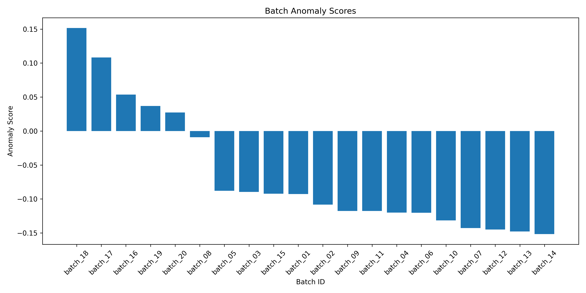
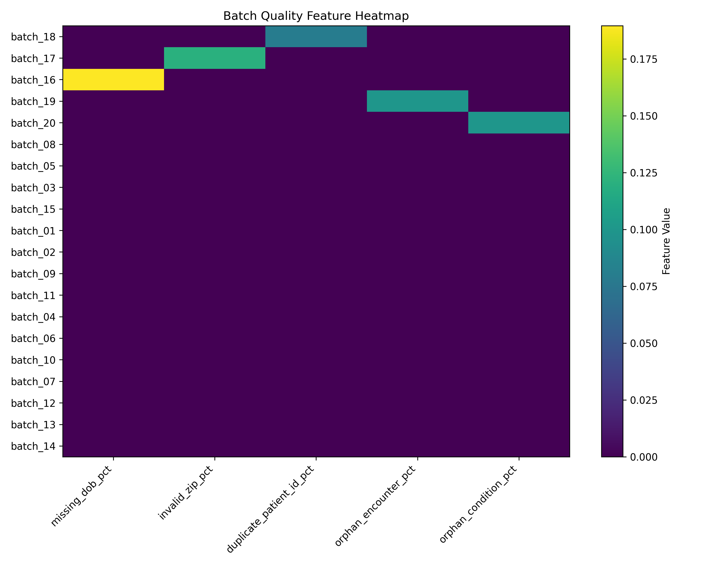
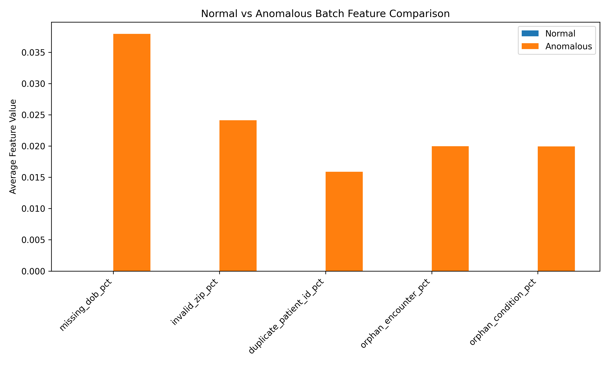

# Healthcare Data Migration Anomaly Detection

A machine learning prototype for identifying risky healthcare migration batches using synthetic patient records.

Built as a practical portfolio project combining data engineering, validation automation, and anomaly detection.

---

## Project Overview

Large-scale healthcare data migrations, such as moving records from legacy systems into modern Electronic Patient Record (EPR) platforms, require multiple staged data loads.

Even when row counts appear correct, hidden issues such as duplicate patients, broken relationships, or missing critical fields can create serious downstream risk.

This project simulates a healthcare migration environment and applies anomaly detection to automatically flag suspicious migration batches before go-live.

---

## Problem Statement

During migration programmes, teams commonly validate:

- Row counts  
- Null values  
- Duplicate records  
- Schema compatibility  
- Basic reconciliation checks  

However, unusual combinations of defects across batches can be difficult to detect manually.

The goal of this project was to build a lightweight monitoring system that prioritises suspicious migration batches for analyst review.

---

## Dataset

Synthetic healthcare records generated using **Synthea**, including three core relational datasets:

- `patients.csv`
- `encounters.csv`
- `conditions.csv`

These datasets simulate realistic healthcare records while avoiding real patient privacy concerns.

---

## Pipeline Architecture

```text
Raw Synthetic Healthcare Data
        ↓
Batch Simulation
        ↓
Injected Migration Defects
        ↓
Validation Checks
        ↓
Feature Engineering
        ↓
Isolation Forest Model
        ↓
Suspicious Batch Ranking
```

---

## Simulated Migration Defects

Five realistic migration anomalies were intentionally introduced into selected batches to simulate common healthcare data migration risks.

| Batch | Injected Issue | Description |
|------|----------------|-------------|
| batch_16 | Missing DOB spike | Increased number of missing dates of birth |
| batch_17 | Invalid ZIP spike | Introduced malformed postcode / ZIP values |
| batch_18 | Duplicate patient IDs | Simulated duplicate patient identifiers |
| batch_19 | Orphan encounters | Encounter records not linked to valid patients |
| batch_20 | Orphan conditions | Condition records not linked to valid patients |

These issues reflect common real-world migration defects involving data completeness, identity integrity, and broken relational links.

---

## Validation Features Engineered

For each migration batch, the following quality metrics were calculated:

- Missing DOB %
- Invalid ZIP %
- Duplicate patient ID %
- Orphan encounter %
- Orphan condition %
- Patient row count
- Encounter row count
- Condition row count

These metrics were used as structured inputs to the anomaly detection model.

---

## Model Used

### Isolation Forest

Isolation Forest was selected because it is highly suitable for operational anomaly detection tasks where labelled failures are limited or unavailable.

### Why this model:

- Does not require labelled historical anomalies
- Works well on tabular batch-level metrics
- Efficient and lightweight
- Practical for migration monitoring scenarios
- Produces anomaly scores for prioritisation

---

## Results

The model successfully ranked all five anomalous batches as the most suspicious batches.

### Top flagged batches:

1. `batch_18` – Duplicate patient IDs  
2. `batch_17` – Invalid ZIP spike  
3. `batch_16` – Missing DOB spike  
4. `batch_19` – Orphan encounters  
5. `batch_20` – Orphan conditions  

### Evaluation Summary

In this controlled prototype, the model correctly identified all injected anomalous batches.

- Accuracy: 100%
- Precision: 100%
- Recall: 100%

These results reflect intentionally simulated defects rather than production complexity.

---
## Business Value

This type of monitoring system could help migration teams:

- Prioritise risky loads faster
- Reduce manual QA effort
- Detect structural data issues early
- Improve confidence before go-live
- Standardise migration assurance checks

---

## Example Outputs

### Batch Anomaly Scores



---

### Feature Heatmap



---

### Normal vs Anomalous Comparison



---

## Tech Stack

- Python
- pandas
- NumPy
- scikit-learn
- matplotlib

---

## Repository Structure

```text
stalis-migration-anomaly-detection/
│── data/
│── outputs/
│── src/
│── README.md
│── requirements.txt
│── main.py # full pipeline entrypoint
```

---
## How to Run

Clone the repository and install dependencies:

```bash
git clone <[https://github.com/hasini-s-de-silva/healthcare-migration-anomaly-detection]>
cd stalis-migration-anomaly-detection
pip install -r requirements.txt
python main.py
```
Run the full pipeline pipeline with one command:
```bash
python main.py
```
This automatically runs:

1. Simulate migration batches
2. Validate data quality
3. Build model features
4. Train anomaly detection model
5. Evaluate predictions
6. Generate charts and reports

### What each step does

| Command | Purpose |
|--------|---------|
| `simulate_batches` | Creates migration batches and injects realistic anomalies |
| `validate_data` | Calculates batch-level data quality and integrity checks |
| `build_features` | Builds the model-ready feature dataset from validation outputs |
| `train_model` | Trains the Isolation Forest model and scores suspicious batches |
| `evaluate_model` | Evaluates predictions against known injected anomalies |
| `report_results` | Generates charts and visual summaries of model outputs |

---

## Real-World Relevance

This prototype reflects common challenges seen in healthcare migration programmes:

- Legacy system to EPR migrations  
- Staged batch validation  
- Referential integrity assurance  
- Automated quality monitoring  
- Reducing manual review effort  
- Surfacing go-live risk early  

---

## Future Improvements

Potential next steps:

- Time-series monitoring across releases  
- Drift detection across future batches  
- Live dashboard for migration assurance  
- Explainable anomaly scoring  
- SQL Server / NHS warehouse integration  
- Threshold alerting system  

---

## Author

**Hasini De Silva**  
MSc Bioinformatics | Data Engineering | Applied AI | Healthcare Data Systems
